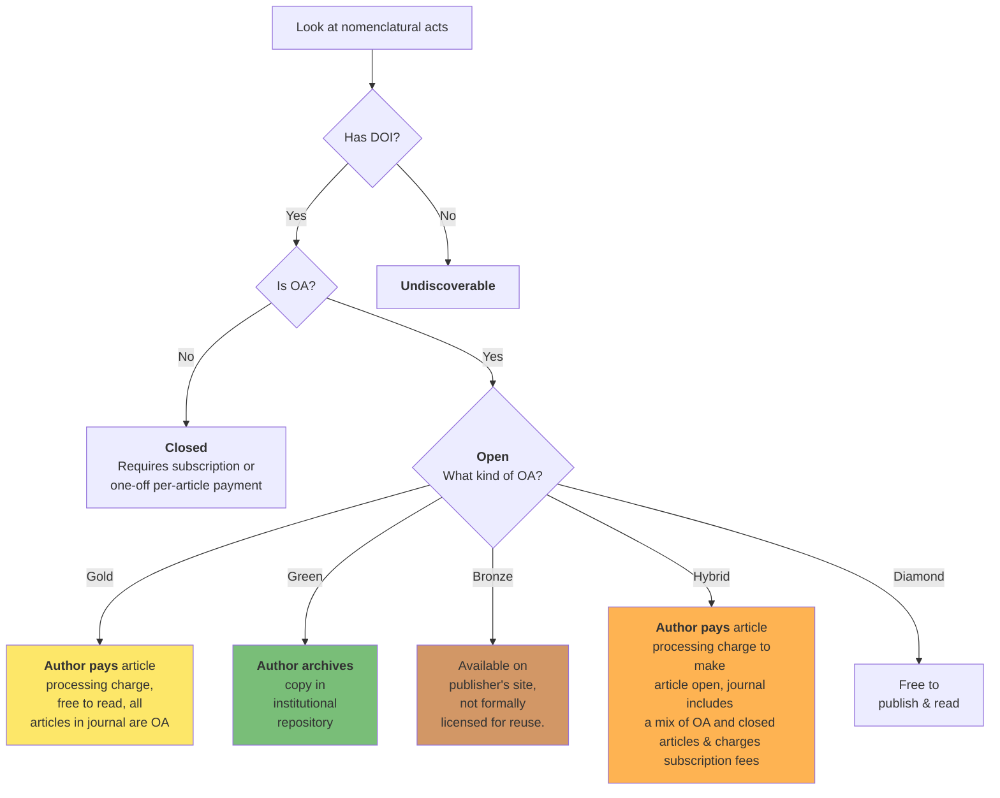

```mermaid
graph TD
    Start[Look at nomenclatural acts] --> HasDOI
    HasDOI{"Has DOI?"}
    HasDOI --> |Yes|IsOA{"Is OA?"}
    HasDOI --> |No|NoDOI[<b>Undiscoverable</b>]
    IsOA -->|No|Closed["<b>Closed</b><br/>Requires subscription or <br/>one-off per-article payment"]
    IsOA -->|Yes|Open{<b>Open</b><br/>What kind of OA?}
    Open -->|Gold|Gold["<b>Author pays</b> article<br/> processing charge,<br/> free to read, all <br/>articles in journal are OA"]
    Open -->|Green|Green["<b>Author archives</b><br/> copy in <br/>institutional <br/>repository"]
    Open -->|Bronze|Bronze["Available on <br/>publisher's site, <br/>not formally <br/>licensed for reuse."]
    Open -->|Hybrid|Hybrid["<b>Author pays</b> article<br/> processing charge to make <br/>article open, journal includes <br/>a mix of OA and closed <br/>articles & charges subscription fees"]
    Open -->|Diamond|Diamond["Free to <br/>publish & read"]
    
    classDef Gold fill:#fde769;
    class Gold Gold;

  classDef Green fill:#79be78;
    class Green Green;

  classDef Bronze fill:#d29766;
    class Bronze Bronze;
    
    classDef Hybrid fill:#feb352;
    class Hybrid Hybrid;


```
